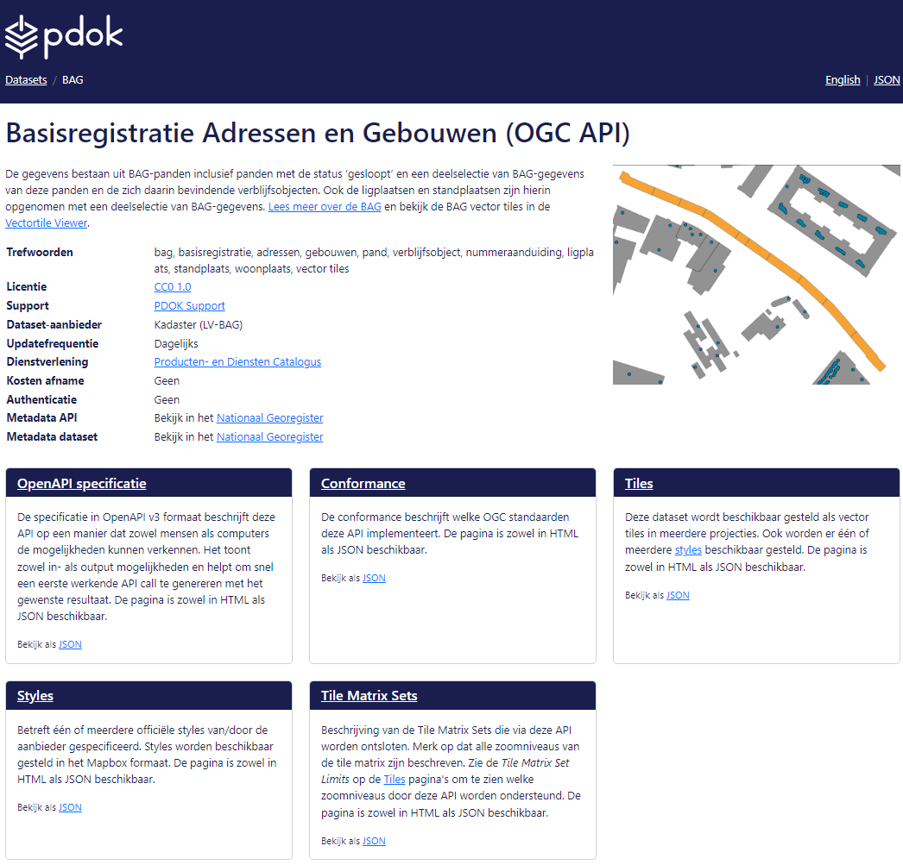
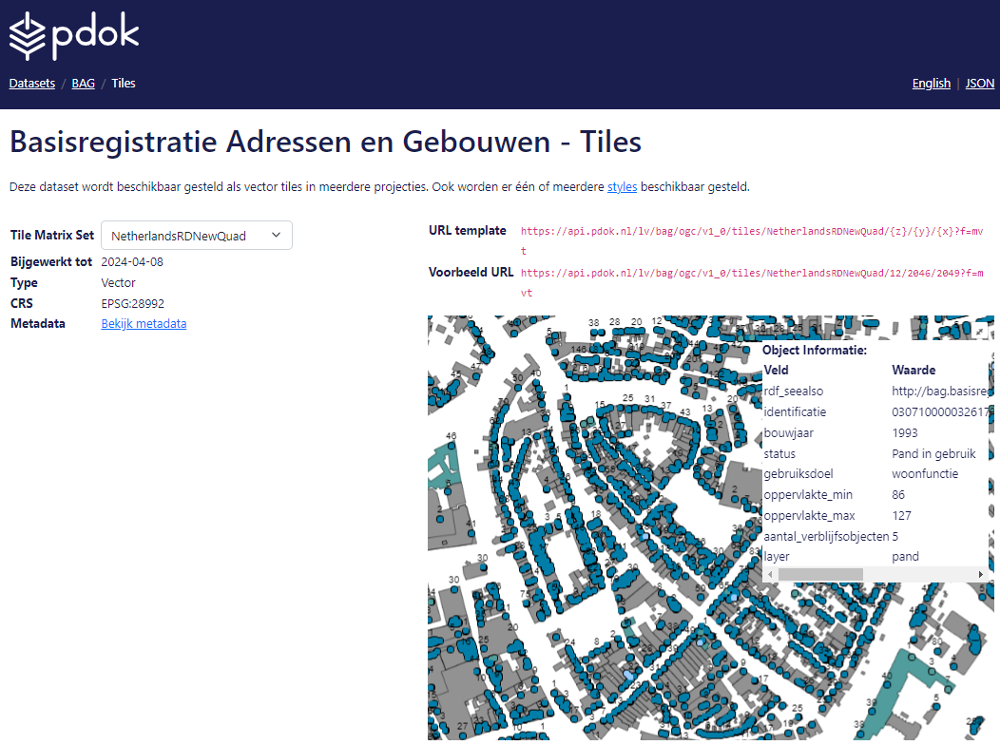

# Verkennen van OGC vector tiles

Deze oefening richt zich op het verkennen van de vector tiles van de BAG en BGT.
We maken gebruik van de landing pages en Swagger UI van PDOK. Als extra
hulpmiddel verwijzen we naar de vector tiles viewer van PDOK voor verdere
verkenning.

## BAG Vector Tiles

Navigeer naar de BAG Vector Tiles op PDOK via de volgende link:
<https://api.pdok.nl/lv/bag/ogc/v1>. Op het scherm wordt de landing page van
de BAG Vector Tiles API weergegeven.

We gaan nu de verschillende onderdelen van de BAG Vector Tiles API langs.

### Conformance

De Conformance-sectie beschrijft welke OGC-standaarden deze API implementeert.
Deze pagina is beschikbaar in zowel HTML- als JSON-indeling. Onder "Conformance"
kun je zien aan welke standaarden de API voldoet.

Klik op de landing page op Conformance en ga naar
<https://api.pdok.nl/lv/bag/ogc/v1/conformance>

-   Welke versie van de OGC Vector Tiles-specificaties wordt toegepast?

-   Welke specificatie voor vector tiles-encoding wordt gebruikt?

### Tiles

Deze dataset wordt gepresenteerd als vector tiles in verschillende projecties,
met één of meerdere stijlen. De pagina is beschikbaar in HTML- en JSON-indeling.
Onder "Tiles" wordt vermeld dat de BAG-data beschikbaar is als vector tiles in
diverse projecties en stijlen.

Klik op de landing page op Tiles en ga naar
<https://api.pdok.nl/lv/bag/ogc/v1/tiles>.

Aan de linkerkant zie je de TileMatrixSet die je bekijkt, en aan de rechterkant
een voorbeeldtegel van de BAG. Bekijk de URL-template.

-   Wat vertegenwoordigen {z}, {x} en {y} in de URL?

Kopieer en plak de voorbeeld-URL in je browser. Een binair vector tiles-bestand
wordt nu gedownload.

-   Hoe groot is het bestand in kilobytes?

Open het bestand in een teksteditor zoals Kladblok, Notepad++ of VS Code.

-   Welke elementen herken je in het bestand?

Bekijk de metadata van de verschillende Tile Matrix Sets.

-   Op welk zoomniveau is de TileMatrixSet WebMercatorQuad beschikbaar?

-   Welke dimensies heeft de TileMatrixSet WebMercatorQuad?

Hetzelfde geldt voor EuropeanETRS89_LAEAQuad.

-   Waarom verschillen deze zoomniveaus en dimensies?

Bekijk de metadata van de NetherlandsRDNewQuad Tile Matrix Set.
<https://api.pdok.nl/lv/bag/ogc/v1/tiles/NetherlandsRDNewQuad>.

Druk op [NetherlandsRDNewQuad](https://api.pdok.nl/lv/bag/ogc/v1/tileMatrixSets/NetherlandsRDNewQuad) om alle zoomniveaus te zien.

-   Waar bevindt zich ongeveer het oorsprongs- of referentiepunt van deze Tile
    Matrix Set?

*Hint: Het referentiepunt is zichtbaar in RD-coördinaten. Zoek een reversed
geocoder op internet om de locatie te vinden.*

### Styles

Dit omvat één of meerdere officiële stijlen die zijn gespecificeerd door de
aanbieder. De stijlen worden beschikbaar gesteld in het Mapbox-formaat. Deze
pagina is beschikbaar in zowel HTML als JSON-indeling.

Kies op de landing page Styles en ga naar
<https://api.pdok.nl/lv/bag/ogc/v1/styles>.

-   Hoeveel stijlen zijn beschikbaar voor de BAG?

-   Wat merk je op wanneer je schakelt tussen de standaardvisualisatie van BAG
    voor NetherlandsRDNEwQuad en EuropeanETRS89_LAEAQuad?

### OpenAPI-specificatie

De specificatie in OpenAPI v3-formaat beschrijft deze API op een manier die
zowel mensen als computers in staat stelt om de mogelijkheden te verkennen. Het
toont zowel invoer- als uitvoermogelijkheden en helpt bij het snel genereren van
een eerste werkende API-aanroep met het gewenste resultaat. Deze pagina is
beschikbaar in zowel HTML als JSON-indeling.

Kies op de landing page OpenAPI-specificatie en ga naar
<https://api.pdok.nl/lv/bag/ogc/v1/api>

Via de Swagger UI kun je verschillende 'GET' en/of 'POST'-verzoeken op deze API
uitproberen en de respons bekijken.

*Hint: Via 'Try Out' kun je de invoervelden aanpassen. Druk vervolgens op de
knop 'Execute'.*

-   Wat is het end-point van de BAG API?

-   Met welk GET-verzoek kun je alle beschikbare stijlen opvragen?

Haal de tegel op die wordt weergegeven in de HTML van de /tiles-landingspagina
die je via de Swagger UI kunt opvragen.

-   Wat zijn de {z}, {x} en {y} van deze vector tegel, en hoe groot in kB is
    deze tegel als je ‘m download?

*Hint: Begin met het opvragen van de HTML-pagina van /tiles via een GET-verzoek.
Bekijk de respons, zoek naar de voorbeeld-URL en vul de waarden van {z}, {x} en
{y} in de gebruikersinterface in om via een GET-verzoek de betreffende tegel op
te halen.*

## BGT Vector Tiles

Verken de BGT Vector Tiles aan de hand van dezelfde vragen en opdrachten van
Conformance, Tiles, Styles, Tile Matrix Sets en OpenAPI-specificaties, zoals we
gedaan hebben bij de BAG Vector Tiles.

Navigeer naar de BGT Vector Tiles op PDOK via de volgende link:
<https://api.pdok.nl/lv/bgt/ogc/v1>. Op het scherm verschijnt de
landingspagina van de BGT Vector Tiles API. Verken de beschikbare
functionaliteiten en informatie aan de hand van de volgende vragen:

-   Conformance: Welke OGC-standaarden implementeert deze API? Bekijk de
    beschikbare conformance-pagina zowel in HTML als JSON-formaat.

-   Tiles: Hoe wordt de dataset gepresenteerd als vector tiles? Hoeveel
    verschillende projecties zijn beschikbaar? Bekijk de URL-template en begrijp
    de betekenis van {z}, {x} en {y} in de URL. Probeer een voorbeeldtegel op te
    vragen en bekijk het gedownloade bestand.

-   Styles: Hoeveel officiële stijlen worden er aangeboden voor de BGT? Wat is
    het formaat van deze stijlen?

-   Tile Matrix Sets: Hoeveel matrixsets zijn er beschikbaar voor de BGT? Wat
    zijn de dimensies en zoomniveaus van de verschillende Tile Matrix Sets?

-   OpenAPI-specificaties: Wat is het endpoint van de BGT API? Welk GET-verzoek
    kun je gebruiken om alle beschikbare stijlen op te vragen? Probeer de tegel
    op te halen die wordt weergegeven in de HTML van de /tiles-landingspagina
    via de Swagger UI. Gebruik hiervoor de voorbeeld-URL en vul de juiste
    waarden van {z}, {x} en {y} in de gebruikersinterface in om de tegel op te
    vragen.

## Tip: Ontdek de Vector Tiles Viewer!

Als je meer vector tiles wilt zien, ga dan naar
<https://app.pdok.nl/vectortile-viewer>. Hier vind je een interactieve kaart
met verschillende datasets in vector tiles formaat, waar je kunt inzoomen op een
gebied naar keuze en direct gegevens kunt bekijken. **Let op**: je ziet meer als je inzoomt.
