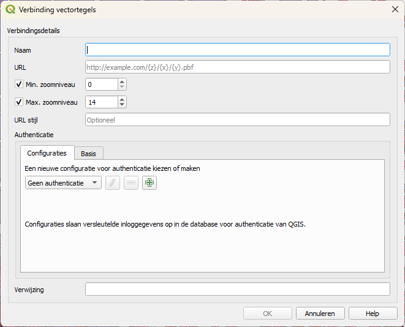
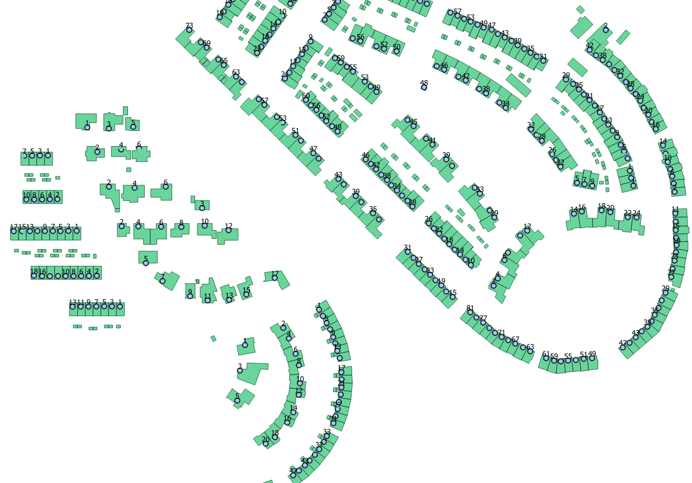

# Verkennen van OGC API Features

Bij deze oefeningen gaan we dieper in op het verkennen van de OGC API Features
van de BGT. We zullen de demo van PDOK gebruiken om praktische vaardigheden te
ontwikkelen voor het navigeren en filteren van geografische data.

## BGT OGC Api Features (OAF)

## BGT OGC API Features

Ga naar de demo van PDOK die sinds 11 maart 2024 beschikbaar is:
<https://api.pdok.nl/lv/bgt/ogc/v1_0-demo/>. Je komt de terecht op de landing
page.

### Conformance

Ga naar de Conformance sectie.

1.  Wat valt je op aan de Conformance-sectie in vergelijking met de conformance
    van de Vector Tiles?

### Collecties

Bekijk de beschikbare feature collecties onder het kopje "Collecties" op de
landing page: <https://api.pdok.nl/lv/bgt/ogc/v1_0-demo/collections> .

1.  Tot welke datum zijn deze feature collecties bijgewerkt?

Open de collectie "Bakken" en bekijk de beschikbare informatie.

1.  In hoeveel coördinatenreferentiesystemen zijn de features van Bakken
    beschikbaar?

2.  In welke formaten worden de features beschikbaar gesteld?

Klik op "Blader door Features" binnen de "Bakken" collectie.

1.  Hoeveel objectversies zijn er van het eerste object dat voorkomt in de
    lijst?

2.  Wat is het type van feature van item 3092?

Leer hoe features gefilterd kunnen worden op datum en ID.

1.  Op welke datum werd het feature met LokaalID
    G0518.08d6e6ee5822653ae0502a0a313c2ff8 in de LV opgenomen?

Vind de begindatum van het oudste "Bakken" feature door terug te gaan in de
tijd.

1.  Wat is het begindatum van het ‘oudste’ Bakken feature?

*Hint! Ga zo’n 16 jaar terug in de tijd.*

### Open API Specificaties

Verken de OpenAPI Specificaties van BGT OAF via de Swagger UI en vind het
endpoint.

1.  Wat is het endpoint van deze API?

Leer hoe je features binnen een bounding box kunt opvragen.

1.  Hoe kun je features binnen een bounding box opvragen via deze API?

### Conformance

Bekijk de Conformance, wat valt je op t.o.v. de conformance van de Vector Tiles?

### Collecties

Onder het kopje Collecties zie je alle feature collecties die beschikbaar zijn
in deze BGT OGC Api Features.

<https://api.pdok.nl/lv/bgt/ogc/v1_0-demo/collections>

Tot welke datum zijn deze feature collecties bijgewerkt?

Bekijk ook de JSON presentatie:
<https://api.pdok.nl/lv/bgt/ogc/v1_0-demo/collections?f=json>

Open de collectie Bakken.

In hoeveel coordinaatreferentiesystemen zijn de features van Bakken beschikbaar?

In welke formaten worden de features beschikbaar gesteld?

Klik op ‘Blader door Features’

<https://api.pdok.nl/lv/bgt/ogc/v1_0-demo/collections/bakken/items>

Hoeveel objectversies zijn er van het eerste object dat voorkomt in de lijst?

<https://api.pdok.nl/lv/bgt/ogc/v1_0-demo/collections/bakken/items?lokaal_id=G0518.fcb8ea5528f5b4fae0402a0a313c2f1b>

De features kunnen gefilterd worden op datum en ID.

### Filteren op objectID

Wat is het type van feature van item 3092?

<https://api.pdok.nl/lv/bgt/ogc/v1_0-demo/collections/bakken/items/3092>

Op welke datum werd het feature met LokaalID
G0518.08d6e6ee5822653ae0502a0a313c2ff8

in de LV opgenomen?

<https://api.pdok.nl/lv/bgt/ogc/v1_0-demo/collections/bakken/items?lokaal_id=G0518.08d6e6ee5822653ae0502a0a313c2ff8>

Hoeveel objectversies van het eerste object dat voorkomt?

<https://api.pdok.nl/lv/bgt/ogc/v1_0-demo/collections/bakken/items?lokaal_id=G0518.fcb8ea5528f5b4fae0402a0a313c2f1b>

Wat is het begindatum van het ‘oudste’ Bakken feature?

[https://api.pdok.nl/lv/bgt/ogc/v1_0-demo/collections/bakken/items?datetime=2008-01-01T00%3A00%3A00.000Z&f=json&limit=100](https://api.pdok.nl/lv/bgt/ogc/v1_0-demo/collections/bakken/items?datetime=2008-01-01T00%3A00%3A00.000Z&f=json&limit=1000)

Hint! Ga zo’n 16 jaar terug in de tijd.

## OpenAPI specificatie

Via de Swagger UI

Wat is het endpoint van deze API?

Opvragen van

Features binnen bounding box

# Gebruiken van OGC API’s in GIS software

Voor deze opdrachten is QGIS of andere GIS software nodig dat Vector Tiles en
Open Api Features kan inlezen.

Tip: Gebruik je QGIS, download dan ook de PDOK Service Plugin. Doe dit via
Plug-ins » Plug-ins beheren en installeren en zoek vervolgens op PDOK. Voeg
eventueel ook de PDOK Locatieserver plug-in toe.

## BAG en BGT Vector Tiles

### Openen van vector Tiles

Start QGIS en ga naar het paneel Browser, zoek Vector Tiles, en klik op Nieuwe
algemene verbinding.

Onderstaand venster opent, vul de naam ‘BAG Vector Tiles’ en URL

[https://api.pdok.nl/lv/bag/ogc/v1_0/tiles/WebMercatorQuad/{z}/{y}/{x}?f=mvt](https://api.pdok.nl/lv/bag/ogc/v1_0/tiles/WebMercatorQuad/%7bz%7d/%7by%7d/%7bx%7d?f=mvt)

Welk max. zoomniveau moet de verbinding worden ingesteld?

Hint: Kijk op https://api.pdok.nl/lv/bag/ogc/v1_0/tiles/WebMercatorQuad.

Klik op OK en voeg de laag toe aan het QGIS project via dubbelklik of
rechtsmuisknop » Laag aan project toevoegen…

Zoom in op een stuk Nederland (gebruik eventueel een andere PDOK achtergrondlaag
hiervoor bijvoorbeeld een luchtfoto of de BRT achtergrondkaart). Zoom in op
ongeveer 1:3100 om gegevens te zien.

Je ziet nu een kaart dat vergelijkbaar is met onderstaande afbeelding:

### Styling toevoegen

Klik met de rechtsmuisknop in het paneel Browser onder Vector Tiles op de BAG
Vector Tiles en selecteer Verbinding bewerken…

Kijk op <https://api.pdok.nl/lv/bag/ogc/v1_0/styles>

Herhaal bovenstaande stappen met de BGT Vector Tiles,

URL:
[https://api.pdok.nl/lv/bgt/ogc/v1_0/tiles/WebMercatorQuad/{z}/{y}/{x}?f=mvt](https://api.pdok.nl/lv/bgt/ogc/v1_0/tiles/WebMercatorQuad/%7Bz%7D/%7By%7D/%7Bx%7D?f=mvt)

experimenteer met de verschillende styles

<https://api.pdok.nl/lv/bgt/ogc/v1_0/styles>.

Let op het zoomniveau.

Bekijk en combineer de BAG met de BGT Vector Tiles.

### Informatie over een object opvragen

Klik in de werkbalk Attributen op de knop ‘Objecten identificeren’ of via de
sneltoetscombinatie CTRL+SHIFT+I.

[https://api.pdok.nl/lv/bgt/ogc/v1_0/tiles/WebMercatorQuad/{z}/{y}/{x}?f=mvt](https://api.pdok.nl/lv/bgt/ogc/v1_0/tiles/WebMercatorQuad/%7Bz%7D/%7By%7D/%7Bx%7D?f=mvt)

Vraag de gegevens van één of meer objecten.

### 

### 

### 

### 

### Onder de motorkap

Om te begrijpen hoe QGIS de API’s onder de motorkap bevraagd openen we de
debugging.

Ga naar Beeld \> Panelen \> Gereedschappen voor debuggen/ontwikkeling. Klik op
de rode knop ‘Log opnemen’.

Zoom in/uit, of schakel één of meer lagen in of uit om opnieuw de API’s te
bevragen. In het debugging-venster zie je nu meerdere GET requests verschijnen.

Klik met de rechtermuisknop op een GET request en kies URL openen. Doe dit voor
zowel de BAG als BGT vector tiles.

## BGT API Features

We gaan nu de BGT API Features laden in QGIS

Ga in QGIS in het paneel Browser naar WFS/ OGC API Features en selecteer Nieuwe
verbinding toevoegen…

<https://api.pdok.nl/lv/bgt/ogc/v1_0-demo/>

### Opvragen van attributen

### Filteren op attributen

### Filteren op peildatum

106860, 446100

"creation_date" = '2020-01-01T00:00:00.001Z'

# Gebruiken van OGC API in Web map clients

<https://maplibre.org/maplibre-gl-js/docs/examples/vector-source/>

Vraag een vector tegel op.

**https://api.pdok.nl/lv/bag/ogc/v1_0/tiles/NetherlandsRDNewQuad/5/10/15**

?f=mvt achter het request.

**https://api.pdok.nl/lv/bag/ogc/v1_0/tiles/WebMercatorQuad?f=json**

<https://api.pdok.nl/lv/bgt/ogc/v1_0/>

<https://api.pdok.nl/lv/bgt/ogc/v1_0/tiles/NetherlandsRDNewQuad/12/2048/2050?f=mvt>

Het configureren van een OGC API Features Service in QGIS vereist een paar
stappen. Hier is een algemeen overzicht van wat je moet doen:

1\. Open QGIS: Start QGIS op je computer.

2\. Voeg een nieuwe laag toe: Ga naar het paneel 'Browser' in QGIS en zoek naar
de optie om een nieuwe laag toe te voegen. Dit kan variëren afhankelijk van de
versie van QGIS die je gebruikt, maar je zou een optie moeten vinden om een 'OGC
API Features'-laag toe te voegen.

3\. Kies het type verbinding: Klik op de optie voor een nieuwe verbinding en
selecteer 'OGC API Features' (dit kan worden aangeduid als WFS3 in sommige
versies van QGIS).

4\. Voer de URL in: Voer de URL in van de OGC API Features Service die je wilt
gebruiken. Deze URL wordt meestal verstrekt door de aanbieder van de service.

5\. Authenticatie instellen (optioneel): Als de service authenticatie vereist,
zorg er dan voor dat je de juiste authenticatie-instellingen configureert, zoals
gebruikersnaam en wachtwoord.

6\. Klik op 'Verbinden': Nadat je de URL hebt ingevoerd en eventuele
authenticatie-instellingen hebt geconfigureerd, klik je op 'Verbinden' om
verbinding te maken met de service.

7\. Kies de laag: Als de verbinding succesvol is, zou je een lijst met
beschikbare lagen moeten zien. Kies de laag die je wilt toevoegen aan je kaart.

8\. Configureer aanvullende instellingen: Afhankelijk van de specifieke service
kunnen er aanvullende instellingen zijn die je kunt configureren, zoals
attributen om op te halen of filters die moeten worden toegepast. Deze
instellingen kunnen variëren afhankelijk van de OGC API Features-implementatie
die je gebruikt.

9\. Voeg de laag toe aan je kaart: Nadat je alle instellingen hebt
geconfigureerd, klik je op 'Toevoegen' of 'OK' om de laag toe te voegen aan je
kaart.

10\. Bekijk en analyseer de gegevens: Nu zou je de toegevoegde laag moeten kunnen
zien in de kaartweergave van QGIS. Je kunt vervolgens de gegevens bekijken,
analyseren en bewerken zoals je normaal zou doen met andere lagen in QGIS.

Om OGC Vector Tiles te openen in QGIS, volg je deze stappen:

1\. Open QGIS: Start QGIS op je computer.

2\. Voeg een nieuwe laag toe: Ga naar het paneel 'Browser' in QGIS en zoek naar
de optie om een nieuwe laag toe te voegen.

3\. Kies het type verbinding: Klik op de optie voor een nieuwe verbinding en
selecteer 'OGC API Vector Tiles'.

4\. Voer de URL in: Voer de URL in van de OGC Vector Tiles-service die je wilt
gebruiken. Deze URL wordt meestal verstrekt door de aanbieder van de service.

5\. \*\*Authenticatie instellen\*\* (optioneel):

Als de service authenticatie vereist, configureer dan de juiste
authenticatie-instellingen, zoals gebruikersnaam en wachtwoord.

6\. \*\*Klik op 'Verbinden'\*\*:

Nadat je de URL hebt ingevoerd en eventuele authenticatie-instellingen hebt
geconfigureerd, klik je op 'Verbinden' om verbinding te maken met de service.

7\. \*\*Kies de tegelset en stijl\*\*:

Als de verbinding succesvol is, zou je een lijst met beschikbare tegelsets en
stijlen moeten zien. Kies de tegelset en stijl die je wilt toevoegen aan je
kaart.

8\. \*\*Pas eventuele aanvullende instellingen toe\*\*:

Afhankelijk van de specifieke service kunnen er aanvullende instellingen zijn
die je kunt configureren, zoals attributen om op te halen of filters die moeten
worden toegepast. Deze instellingen kunnen variëren afhankelijk van de OGC
Vector Tiles-implementatie die je gebruikt.

9\. \*\*Voeg de laag toe aan je kaart\*\*:

Nadat je alle instellingen hebt geconfigureerd, klik je op 'Toevoegen' of 'OK'
om de laag toe te voegen aan je kaart.

10\. \*\*Bekijk en analyseer de gegevens\*\*:

Nu zou je de toegevoegde laag moeten kunnen zien in de kaartweergave van QGIS.
Je kunt vervolgens de gegevens bekijken, analyseren en bewerken zoals je normaal
zou doen met andere lagen in QGIS.

Dit zijn de stappen die je moet volgen om OGC Vector Tiles te openen en te
gebruiken in QGIS. De exacte stappen kunnen variëren afhankelijk van de versie
van QGIS die je gebruikt en de specifieke kenmerken van de Vector Tiles-service
waarmee je verbinding maakt.
