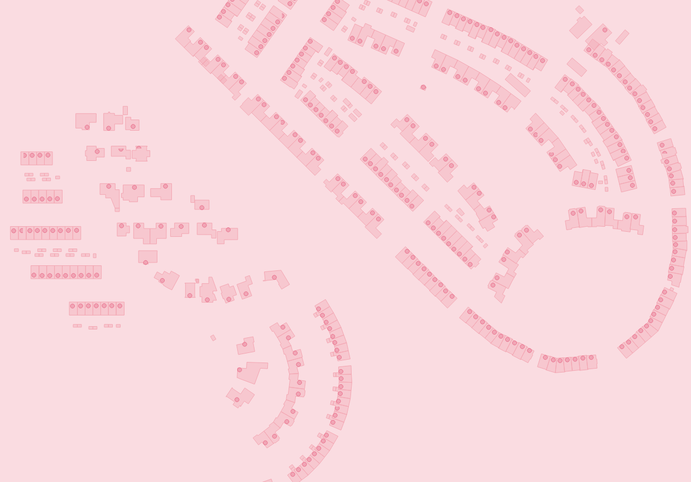
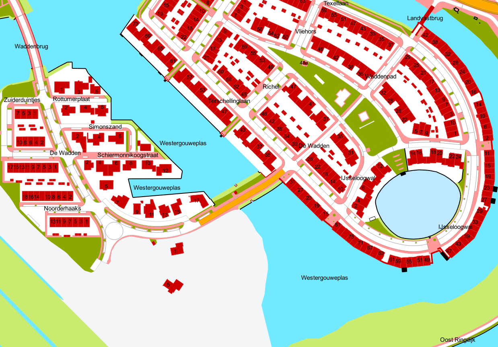
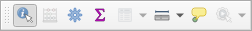

# OGC API’s in GIS software

Voor deze opdrachten is GIS-software zoals QGIS vereist, die Vector Tiles en Open API Features kan verwerken.

*Tip: Als je QGIS gebruikt, installeer dan de PDOK Service Plugin via Plug-ins » Plug-ins beheren en installeren, en zoek naar PDOK. Voeg indien nodig ook de PDOK Locatieserver plugin toe.*

De voorbeelden die we laten zien zijn in de omgeving van Gouda, specifiek in de nieuwe woonwijk WesterGouwe, met RD-coördinaten: 106860, 446100. Je kunt dit gebied gebruiken, maar het is ook interessant om een eigen bekend gebied te kiezen waarvan je weet dat er recent terreinwijzigingen hebben plaatsgevonden.

## Vector Tiles in QGIS

### BAG Vector Tiles Openen

1.  Open QGIS en navigeer naar het Browser-paneel. Zoek naar Vector Tiles en
    klik op 'Nieuwe algemene verbinding...'

    

2\. Vul het onderstaande venster in met de naam 'BAG Vector Tiles' en de URL:
https://api.pdok.nl/lv/bag/ogc/v1_0/tiles/WebMercatorQuad/{z}/{y}/{x}?f=mvt

\- Welk maximaal zoomniveau moet worden ingesteld voor de verbinding?

*Hint: Kijk op https://api.pdok.nl/lv/bag/ogc/v1_0/tiles/WebMercatorQuad.*

3\. Klik op OK en voeg de laag toe aan het QGIS-project via dubbelklikken of
rechtsklikken » Laag aan project toevoegen…

4\. Zoom in op een locatie in Nederland (gebruik eventueel een andere PDOK
achtergrondlaag zoals een luchtfoto of de BRT achtergrondkaart). Zoom in tot
ongeveer 1:3100 om gegevens te bekijken.

5\. Je ziet nu een kaart die vergelijkbaar is met de onderstaande afbeelding.

### Styling toevoegen

6\. In het Browser-paneel, klik met de rechtermuisknop op de BAG Vector Tiles
onder Vector Tiles, en selecteer "Verbinding bewerken…".

7\. Bekijk de beschikbare stijlen op:
<https://api.pdok.nl/lv/bag/ogc/v1_0/styles>

### BGT Vector Tiles in QGIS

8\. Herhaal de bovenstaande stappen met de BGT Vector Tiles:

\- URL:
[https://api.pdok.nl/lv/bgt/ogc/v1/tiles/WebMercatorQuad/{z}/{y}/{x}?f=mvt](https://api.pdok.nl/lv/bgt/ogc/v1/tiles/WebMercatorQuad/%7bz%7d/%7by%7d/%7bx%7d?f=mvt)

\- Experimenteer met de verschillende stijlen op:
<https://api.pdok.nl/lv/bgt/ogc/v1/styles>

*Hint: Let op het zoomniveau tijdens het verkennen.*

9\. Bekijk en combineer de BAG met de BGT Vector Tiles.

### Informatie opvragen

#### Informatie over een object opvragen

Klik in de werkbalk Attributen op de knop ‘Objecten identificeren’ of via de
sneltoetscombinatie CTRL+SHIFT+I.

Vraag de gegevens van één of meer objecten door ze aan te klikken. Bekijk de
gegevens in het paneel Identificatieresultaten.

### 

### 

### 

### Onder de motorkap

Om inzicht te krijgen in hoe QGIS de API's onderliggend bevraagt, openen we de
debugopties.

1.  Ga naar Beeld \> Panelen \> Debugging/Ontwikkelingstools en klik op de rode
    knop 'Log opnemen'.

    

2.  Zoom in/uit of schakel een of meer lagen in/uit om de API's opnieuw te
    bevragen. In het debugvenster verschijnen nu meerdere GET-verzoeken.

    

3.  Klik met de rechtermuisknop op een GET-verzoek en selecteer 'URL openen'.
    Herhaal dit voor zowel de BAG- als de BGT-vector tiles.

## 

## 

## BGT API Features in QGIS

In deze oefening gaan we aan de slag met het laden van BGT API Features in QGIS.
Volg de onderstaande stappen om deze features toe te voegen aan je kaart en om
verschillende handelingen uit te voeren, zoals het opvragen van attributen en
het filteren van gegevens.

### Toevoegen van BGT API Features

1\. Ga in QGIS naar het paneel Browser en selecteer WFS/OGC API Features.

2\. Klik op Nieuwe verbinding toevoegen...

3\. Voer als URL in: https://api.pdok.nl/lv/bgt/ogc/v1/.

4\. Open de volgende feature collecties:

\- Wegdeel

\- OndersteunendWegdeel

\- BegroeidTerreindeel

\- OnbegroeidTerreindeel

\- Waterdeel

\- OndersteunendWaterdeel

\- Pand

\- OverigBouwwerk

5\. Geef de lagen eventueel een andere kleur door rechts te klikken op de
kaartlaag in het paneel Lagen en vervolgens Eigenschappen » Symbologie te
selecteren.

### Opvragen van Attributen

1\. Vergelijkbaar met het opvragen van attribuutgegevens van vector tiles, kun je
in QGIS attribuutgegevens opvragen van features met CTRL+SHIFT+I of de
ObjectIdentificatie-knop. Probeer dit voor een aantal objecten.

### Filteren op Attributen

1\. Dupliceer een laag, bijvoorbeeld de laag met BegroeidTerreindeel of Wegdeel.

2\. Klik met de rechtermuisknop op de gedupliceerde laag en kies Filteren.

3\. Gebruik de Querybouwer om te filteren op specifieke attribuutwaarden.
Bijvoorbeeld, filter de begroeide terreindelen op fysiek-voorkomen
'groenvoorziening' om alle gemeenteplantsoenen in het gebied te selecteren.

4\. Vul de volgende filter-expressie in: "fysiek_voorkomen" = 'groenvoorziening'
en klik op Test en daarna op OK.

### Filteren op Peildatum

1\. Om de situatie op 1 januari 2020 te bekijken, gebruik je hetzelfde mechanisme
als bij het filteren op attributen, maar nu op het datumtijd-attribuut
creation_date.

2\. Vul de volgende filter-expressie in: "creation_date" =
'2020-01-01T00:00:00.001Z' om de situatie op 1 januari 2020 te zien.

3\. Haal de situaties terug van verschillende peildata, bijvoorbeeld 1 januari
2018, 1 januari 2020 en 1 januari 2022.
