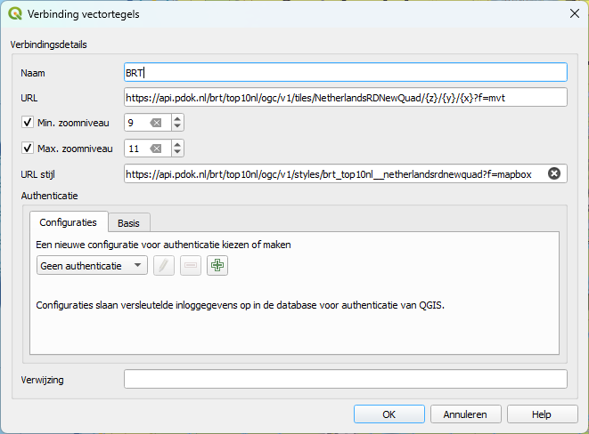
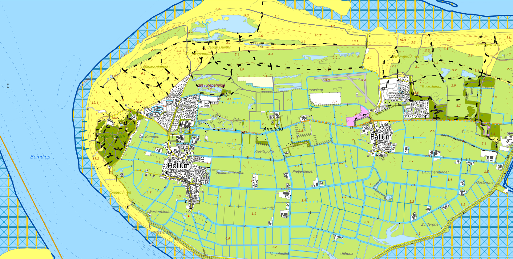

# Oefening 2: Het openen van de BAG vector tiles in QGIS

In deze oefening gaan we de BAG vector tiles in QGIS openen, eerst zonder
styling en vervolgens met de styling van PDOK.

## Stappen om de BAG vector tiles in QGIS te openen zonder styling:

1.  Open QGIS.

2.  Ga naar het menu **Layer** (Laag) en kies voor **Add Layer** (Laag
    toevoegen).

3.  Selecteer **Add Vector Layer** (Voeg Vectorlaag toe).

4.  In het **Source** veld, voer de URL in voor de BAG vector tiles zonder
    styling:

~~~~~~~~~~~~~~~~~~~~~~~~~~~~~~~~~~~~~~~~~~~~~~~~~~~~~~~~~~~~~~~~~~~~~~~~~~~~~~~~
https://api.pdok.nl/lv/bag/ogc/v1_0/tiles/WebMercatorQuad/{z}/{y}/{x}?f=mvt  
~~~~~~~~~~~~~~~~~~~~~~~~~~~~~~~~~~~~~~~~~~~~~~~~~~~~~~~~~~~~~~~~~~~~~~~~~~~~~~~~

1.  Klik op **Add** (Toevoegen) om de vector tiles zonder styling in te laden.

## Stappen om de BAG vector tiles in QGIS te openen met de styling van PDOK:

1.  Voeg de BAG vector tiles toe zoals hierboven beschreven.

2.  Ga naar het **Layer Styling** venster in QGIS en voeg de URL voor de styling
    toe:

~~~~~~~~~~~~~~~~~~~~~~~~~~~~~~~~~~~~~~~~~~~~~~~~~~~~~~~~~~~~~~~~~~~~~~~~~~~~~~~~
https://api.pdok.nl/lv/bag/ogc/v1/styles/bag_standaardvisualisatie__webmercatorquad?f=json
~~~~~~~~~~~~~~~~~~~~~~~~~~~~~~~~~~~~~~~~~~~~~~~~~~~~~~~~~~~~~~~~~~~~~~~~~~~~~~~~

1.  Het is mogelijk dat je een waarschuwing ontvangt over een ontbrekend
    lettertype. Dit gaan we later oplossen.

2.  De styling zal automatisch worden toegepast en de BAG tiles zullen nu
    correct gestyled worden weergegeven.

## Wat valt op wanneer de tiles zonder styling worden ingeladen?

-   Zorg ervoor dat je voldoende inzoomt en let op de zoomniveaus.

-   **Antwoord**: Zonder styling is er een groot vlak over alle objecten heen,
    namelijk de "woonplaats". Wanneer de styling wordt ingeladen, wordt dit vlak
    aangepast zodat de panden zichtbaar worden, en het vlak wordt naar de
    achtergrond verplaatst.

## Probleem met het lettertype:

-   Bij het inladen van de styling kan een waarschuwing verschijnen dat het
    lettertype niet gevonden kan worden.

-   Open de **JSON** van de BAG en zoek naar het lettertype dat wordt genoemd.

    -   Het lettertype is waarschijnlijk een Windows-specifiek lettertype.

-   **Oplossing**: Download en installeer het lettertype op je Windows-systeem.
    Hierdoor wordt het lettertype herkend en de labels zullen correct worden
    weergegeven.

-   Gelukkig zijn er in de JSON meerdere lettertypen gedefinieerd als fallback,
    zodat de labels altijd zichtbaar zijn.

## Laad ook de vector tiles en de styling van de BRT in:

1.  Voeg de BRT vector tiles toe op dezelfde manier:

~~~~~~~~~~~~~~~~~~~~~~~~~~~~~~~~~~~~~~~~~~~~~~~~~~~~~~~~~~~~~~~~~~~~~~~~~~~~~~~~
https://api.pdok.nl/brt/top10nl/ogc/v1/tiles/NetherlandsRDNewQuad/{z}/{y}/{x}?f=mvt
~~~~~~~~~~~~~~~~~~~~~~~~~~~~~~~~~~~~~~~~~~~~~~~~~~~~~~~~~~~~~~~~~~~~~~~~~~~~~~~~

1.  Voeg de bijbehorende styling toe:

~~~~~~~~~~~~~~~~~~~~~~~~~~~~~~~~~~~~~~~~~~~~~~~~~~~~~~~~~~~~~~~~~~~~~~~~~~~~~~~~
https://api.pdok.nl/brt/top10nl/ogc/v1/styles/brt_top10nl__netherlandsrdnewquad?f=mapbox
~~~~~~~~~~~~~~~~~~~~~~~~~~~~~~~~~~~~~~~~~~~~~~~~~~~~~~~~~~~~~~~~~~~~~~~~~~~~~~~~

## 

## Vraag:

-   Hoeveel tijd denk je dat het zou kosten om de uitgebreide styling voor
    TOP10NL zelf in QGIS te configureren?

Dit laat zien hoe het gebruik van de gestandaardiseerde styles via PDOK veel
tijdwinst kan opleveren, aangezien de styling al is voorbereid en geen
handmatige configuratie vereist

Ga verder naar oefening 3.
[oefening 3](https://github.com/Geonovum/ogc-api-workshops/blob/main/03%20vector%20tiles%20with%20styles/handson/styles/oefening3.md)
