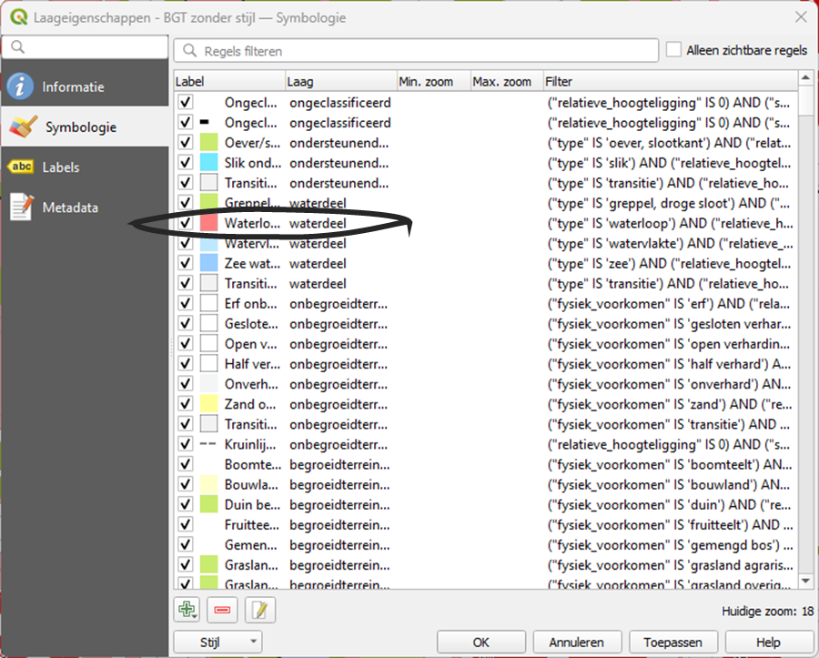

# Oefening 3: Zelf de Styles Aanpassen

In deze oefening gaan we de stijlen van de vector tiles zelf aanpassen door de
JSON handmatig te bewerken. Dit geeft je volledige controle over de stijl en
helpt je te begrijpen hoe het technisch werkt.

## Stappen om de BGT vector tiles zonder stijlen in QGIS in te laden:

1.  Open QGIS.

2.  Voeg de BGT vector tiles toe zonder styling door de volgende URL in te
    voeren voor de vector tiles:

~~~~~~~~~~~~~~~~~~~~~~~~~~~~~~~~~~~~~~~~~~~~~~~~~~~~~~~~~~~~~~~~~~~~~~~~~~~~~~~~
https://api.pdok.nl/lv/bgt/ogc/v1/tiles/WebMercatorQuad/{z}/{y}/{x}?f=mvt
~~~~~~~~~~~~~~~~~~~~~~~~~~~~~~~~~~~~~~~~~~~~~~~~~~~~~~~~~~~~~~~~~~~~~~~~~~~~~~~~

1.  Laad de vector tiles laag in. Let op de zoomlevels (min 12, max 17).

## Download de BGT Standaardvisualisatie in Mapbox formaat:

1.  Download de JSON van de BGT Standaardvisualisatie via de PDOK API:

~~~~~~~~~~~~~~~~~~~~~~~~~~~~~~~~~~~~~~~~~~~~~~~~~~~~~~~~~~~~~~~~~~~~~~~~~~~~~~~~
https://api.pdok.nl/lv/bgt/ogc/v1/styles/bgt_standaardvisualisatie__webmercatorquad/metadata
~~~~~~~~~~~~~~~~~~~~~~~~~~~~~~~~~~~~~~~~~~~~~~~~~~~~~~~~~~~~~~~~~~~~~~~~~~~~~~~~

~~~~~~~~~~~~~~~~~~~~~~~~~~~~~~~~~~~~~~~~~~~~~~~~~~~~~~~~~~~~~~~~~~~~~~~~~~~~~~~~
https://api.pdok.nl/lv/bgt/ogc/v1/styles/bgt_standaardvisualisatie__webmercatornewquad?f=mapbox
~~~~~~~~~~~~~~~~~~~~~~~~~~~~~~~~~~~~~~~~~~~~~~~~~~~~~~~~~~~~~~~~~~~~~~~~~~~~~~~~

1.  Let op de juiste projecties. Als je de WebMercator tiles gebruikt, gebruik
    dan ook de WebMercator stijlen.

## Laad de Stijl in QGIS:

1.  Open de **Laageigenschappen** van de BGT vector tiles laag in QGIS.

    

2.  Klik op **Stijl** en kies **Stijl laden**.

    

3.  Kies de gedownloade JSON file voor de BGT Standaardvisualisatie en laad deze
    in.

    

## Uitleg over de JSON:

-   De JSON die je hebt geladen, wordt via de webservice van PDOK ingeladen en
    bevat de stijlinstellingen voor de vector tiles.

-   We gaan nu een kleur aanpassen, bijvoorbeeld de kleur van het water.

## Pas de kleur aan in de JSON:

1.  Maak een kopie van het originele JSON-bestand met de BGT stijl en geef het
    een andere herkenbare naam.

2.  Open dit JSON-bestand in een teksteditor (zoals Notepad of Visual Studio
    Code).

3.  Zoek naar de stijl die je wilt aanpassen. Bijvoorbeeld de stijl voor
    **waterloop**:

~~~~~~~~~~~~~~~~~~~~~~~~~~~~~~~~~~~~~~~~~~~~~~~~~~~~~~~~~~~~~~~~~~~~~~~~~~~~~~~~
{
    "filter": [
        "all",
        [
            "==",
            "type",
            "waterloop"
        ],
        [
            "==",
            "relatieve_hoogteligging",
            0
        ],
        [
            "==",
            "status",
            "bestaand"
        ]
    ],
    "id": "Waterloop waterdeel fill0",
    "type": "fill",
    "paint": {
        "fill-color": " #73e9ff",
        "fill-outline-color": "#73e9ff",
        "fill-opacity": 0.5
    },
    "source": "bgt",
    "source-layer": "waterdeel"
}
~~~~~~~~~~~~~~~~~~~~~~~~~~~~~~~~~~~~~~~~~~~~~~~~~~~~~~~~~~~~~~~~~~~~~~~~~~~~~~~~

1.  In deze JSON is de kleur van de **waterloop** gedefinieerd door de parameter
    "fill-color": " \#73e9ff". Dit is de kleur die de waterlopen krijgen.

2.  Pas de kleur aan naar een andere kleur, bijvoorbeeld rood (\#ff0000), door
    de waarde van **fill-color** aan te passen:

~~~~~~~~~~~~~~~~~~~~~~~~~~~~~~~~~~~~~~~~~~~~~~~~~~~~~~~~~~~~~~~~~~~~~~~~~~~~~~~~
   "fill-color": "#00ff00"
~~~~~~~~~~~~~~~~~~~~~~~~~~~~~~~~~~~~~~~~~~~~~~~~~~~~~~~~~~~~~~~~~~~~~~~~~~~~~~~~

1.  Sla het bestand op na het aanpassen van de kleur.

**Laad de aangepaste stijl in QGIS**

1.  Ga terug naar QGIS en laad de aangepaste stijl in via de
    **Laageigenschappen** van de BGT vector tiles laag.

2.  De verandering in kleur zal nu zichtbaar zijn in de kaart.

3.  

**Andere stijlconfiguraties**

-   Met de JSON kun je ook andere aspecten van de visualisatie aanpassen, zoals
    het filteren van objecten. Bijvoorbeeld, je kunt de stijl zo aanpassen dat
    alleen de **groenvoorzieningen** zichtbaar zijn door te filteren op de
    source-layer "BegroeidTerreindeel" en fysiekvoorkomen groenvoorziening.

-   Dit maakt het mogelijk om alleen bepaalde objecten te visualiseren op basis
    van je eigen eisen en wensen.

Ga verder naar [oefening 4](https://github.com/Geonovum/ogc-api-workshops/blob/main/03%20vector%20tiles%20with%20styles/handson/styles/oefening4.md).
