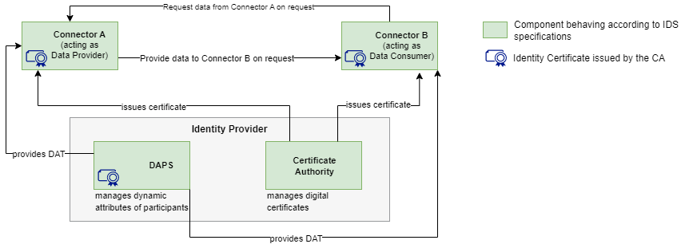

# Achtergrondinformatie

## Het dataspace protocol

Het Dataspace Protocol is een specificatie die veilige en interoperabele datadeling tussen autonome entiteiten mogelijk maakt binnen een dataspace. Het protocol richt zich op het faciliteren van gegevensoverdracht, catalogus en gebruikscontrole en het onderhandelen van overeenkomsten tussen entiteiten via goed gedefinieerde protocollen. 

<b>Verder lezen</b>

<a href='https://docs.internationaldataspaces.org/ids-knowledgebase/dataspace-protocol' target='blank'>IDS Knowledge Base: Dataspace Protocol 2024-1</a>

## Minimal Viable Data Space

De International Data Spaces Association (IDSA) specificeert een Minimum Viable Data Space (MVDS) als een combinatie van componenten die een dataspace mogelijk maken met net genoeg functies om bruikbaar te zijn voor veilige en soevereine gegevensuitwisseling. 

Een MVDS bestaat uit: 
<ul><li>Twee connectoren (één als dataprovider en één als dataconsumer)</li> 
<li>Een identiteitsprovider (Dynamic Attribute Provisioning Service, Certificate Authority)</li> 
<li>Optionele en aanvullende componenten, zoals een metadata broker, een app store, een clearinghouse of een vocabulaireprovider, kunnen aan de MVDS worden toegevoegd om de functionaliteit uit te breiden en meer geavanceerde functies mogelijk te maken, zoals het zoeken naar datasets.</li></ul>

De MVDS biedt een startpunt voor het creëren van een functionele dataspace die daarna kan worden aangepast en uitgebreid om aan specifieke vereisten te voldoen. 

In het experiment dat Geonovum en Sogelink hebben uitgevoerd is ook toegewerkt naar een MVDS.  
</img>

<b>Verder lezen</b>

<a href='https://docs.internationaldataspaces.org/ids-knowledgebase/ids-reference-testbed/minimum-viable-data-space/mvds' target='blank'>IDS Knowledge Base: What is a Minimum Viable Data Space?</a>

## TNO Security Gateway (TSG) 

De TNO Security Gateway (TSG) is een open-source IDS-connector implementatie. De TSG bestaat uit de onderdelen: 

<ul><li>Control Plane: zorgt voor catalogisering, contractonderhandelingen en management van overdrachtsprocessen. Daarnaast is er een register-/servicescatalogus-component</li> 
<li>HTTP Data Plane: een basis implementatie die het mogelijk maakt om HTTP-gebaseerde applicaties (zowel servers als clients) te ontsluiten.</li> 
<li>Wallet: een SSI-portemonnee die verifieerbare credentials kan uitgeven en opslaan, en presentaties kan aanmaken om te gebruiken binnen dataspaces.</li></ul>

<b>Verder lezen</b> 

<a href='https://tsg.dataspac.es/' target='blank'>TNO Security Gateway</a> 

Ga door naar het <a href='PracticalPart.md'>praktijk gedeelde van deze workhop</a>